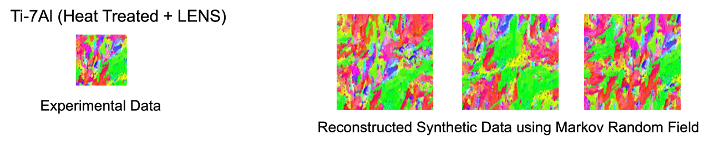

# Welcome to the Advanced Structures and Optimization Lab (AstroLab) at Virginia Tech

At AstroLab, we are interested in computational problems such as **multi-scale modeling**, **optimization**, **uncertainty quantification**, **model reduction**, and **machine learning** for different materials, including **metals**, **metallic alloys**, **composites**, and **meta-materials**. Our work spans multiple length scales, ranging from **micro-scale** to **component-level**, in environments that range from **moderate to extreme** conditions, with a special focus on **design**. 

## Our Areas of Focus:
Our research interests are including (but not limited to) the following topics:

### 1. **Multi-Scale Modeling of Metallic Microstructures:**
We develop computational models to bridge processing-microstructure-properties for metallic microstructures. These models investigate how thermo-mechanical processing variables affect the evolution of microstructures, as well as the development of material properties throughout components. 

### 2. **Multi-Scale Computational Design of Mechanical Metamaterials:**

We build computational tools to design mechanical metamaterials. We focus on the characterization of non-periodically repeating metamaterial architectures, the development of numerical homogenization methods, building mechanical property spaces, and multi-scale design of metamaterial architectures.

### 3. **Materials Design under Uncertainty:**

The deterministic computational models are not powerful for precisely capturing the structural response of engineering components due to the variations in structural properties (aleatoric uncertainty), or modeling/mathematical inaccuracies in computational simulations (epistemic uncertainty). Such variability can propagate over the computational models and significantly impact the expected performance. Our goal is to build stochastic multi-scale computational environments to model and optimize engineering materials (metals, composites, polymers, metamaterials) by considering these aleatoric and epistemic uncertainties. 

### 4. **Computational Modeling of Ferromagnetic-Paramagnetic Phase Transition of Magnetic Materials:**

The existing knowledge on the determination of the magnetic phase transition zone is based on simplified analyses as the comprehensive effects of the long-range interactions among the magnetic spins, external parameters, and uncertainties have been neglected. We propose to determine the ferromagnetic-paramagnetic phase transition onset and quantify the likelihood of the transition by examining: i) high-order interactions between the magnetic spins and external fields; ii) long-range effects including the grain boundaries and dislocations; iii) propagation of the uncertainties in external fields and temperature. 

### 5. **Machine Learning and Data-Driven Modeling and Design of Materials:**

The multi-scale computational techniques have not been utilized for engineering-scale structural optimization problems due to the excessive computational cost of the multi-scale simulations involving billions of degrees of freedom. Machine learning-reinforced and data-driven models are found to provide efficient mathematical surrogates that are perfectly suited to overcome this computational burden. Our goal is to use this mathematically-rigorous approach to represent the multi-scale and complex interplay between processing, materials, and properties with their data-driven surrogates.

### 6. **Physics-Based and Data-Driven Modeling for Thermo-Mechanical Processing of Additively Manufactured Metals:**

We develop physics-based and data-driven models for additively manufactured metals to investigate the formation and evolution of microstructural features, including crystallographic texture and grain topology. Applications include the design of Ti-Al and Nickel-based alloys during electron beam melting and MELD processes to be used for aerospace systems.

---

**Contact Information:**
- **Lab Website:** [AstroLab - Virginia Tech](https://sites.google.com/vt.edu/astrolab/home)

Looking forward to collaborating and sharing knowledge!

